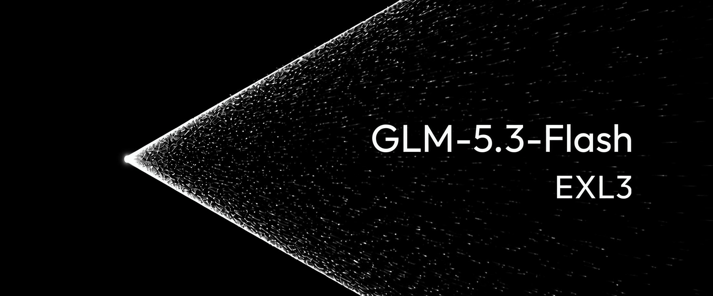

# SparkGLM



SparkGLM is an open research project for running **GLM-5.3-Flash on exactly two
NVIDIA DGX Spark GB10 systems**. The current runnable path is an opinionated
vLLM/EXL3 appliance derived from MiaAI-Lab's two-Spark recipe. The repository
also preserves the earlier Atlas-native implementation and the experiments
that succeeded, failed, or changed the direction of the project.

> **Release-candidate status:** this repository is staged privately for a
> publication review. It has not been declared production-ready, and no
> repository visibility change is part of this commit.

> **Known semantic approximation:** the current FlashInfer SM121 compatibility
> path can represent 2048 sparse-MLA candidates while GLM-5.3 may produce 2051.
> SparkGLM retains the recent tail and omits the four lowest-ranked pooled
> candidates. This affects at most 4/2051 candidates at those rows, but it is
> still a model-semantic deviation—not “exact inference.” See
> [known limitations](docs/KNOWN_LIMITATIONS.md).

## How changes earn promotion

```text
idea -> static checks -> exact-shape operator -> tinyGLM
     -> full 16K/32K C1/C2 comparison -> quality/reliability -> default
```

This promotion path is the center of the project. tinyGLM is the mandatory
fast integration gate: it preserves the production kernel geometry without a
164 GiB model load. It decides whether a candidate deserves full-model time;
it never substitutes for real-model performance or quality evidence.

Read [the test methodology](docs/METHODOLOGY.md), then browse the canonical
[current qualification status](results/CURRENT.md) and the complete
[results and qualification index](results/README.md). Every performance claim
must point to a checksum-bound `qualification.json`. Pre-policy results are
kept as explicitly legacy evidence rather than retroactively certified.

## Start here

- **Check the component licenses before downloading:** read
  [docs/LICENSING.md](docs/LICENSING.md). The default reproduces the published
  four-stream video's DFlash2 configuration. Its separately downloaded
  checkpoint is CC BY-NC-ND 4.0 and therefore non-commercial/no-derivatives;
  use `SPEC_METHOD=mtp` or `none` when those terms do not fit.
- **Run the current engine:** follow the build and two-node launch process in
  [SPARKGLM.md](SPARKGLM.md) and the detailed upstream recipe guide in
  [docs/upstream/MIA_RECIPE_README.md](docs/upstream/MIA_RECIPE_README.md).
  Stop any resident full model before `BUILD=1`: native EXL3 compilation and a
  loaded checkpoint compete for the GB10's unified memory. The launcher now
  refuses a build below 32 GiB `MemAvailable` unless the operator deliberately
  sets `BUILD_MIN_MEM_GIB=0`.
- **Reproduce what we showed:** the fresh-checkout defaults and their exact
  historical evidence are mapped in
  [the published-video configuration](docs/PUBLISHED_VIDEO_CONFIGURATION.md).
  The earlier reconstruction omitted inherited engine code; the
  [source-restoration audit](docs/VIDEO_SOURCE_RESTORATION.md) explains the
  correction, explicit equivalence boundary, and new test evidence.
- **Understand what is original:** read
  [docs/PROVENANCE.md](docs/PROVENANCE.md) and
  [docs/ATTRIBUTION.md](docs/ATTRIBUTION.md), then consult the practical
  [licensing boundaries](docs/LICENSING.md).
- **Inspect the evidence:** see [docs/RESULTS.md](docs/RESULTS.md), retained raw
  receipts and reports under `results/`, and the code archive under
  `research/vllm-iterations/`.
- **Inspect the native-engine attempt:** see `research/atlas/`. It is valuable
  research, but it is not the recommended serving path.
- **Review before publication:** see
  [docs/PUBLICATION_REVIEW.md](docs/PUBLICATION_REVIEW.md).
- **Know what remains unproven:** read
  [docs/KNOWN_LIMITATIONS.md](docs/KNOWN_LIMITATIONS.md) before deployment or
  quoting a result.

## What is running code versus research

| Path | Status | Purpose |
| --- | --- | --- |
| repository root | current candidate | Two-Spark vLLM + EXL3 serving recipe and optimized kernels |
| `benchmarks/` | test harnesses | Reproducible endpoint, tinyGLM, and kernel A/B programs |
| `results/` | canonical evidence | Indexed qualification records, reports, raw receipts, limitations, and rejected work |
| `research/current-engine-history/` | provenance | Accepted commit mailbox without unsafe historical git objects |
| `research/vllm-iterations/` | historical | Accepted and rejected vLLM-era experiments, measurements, and patch mailboxes |
| `research/atlas/` | archival | AGPL Atlas GLM implementation, probes, and a reconstructable source patch |

The project deliberately retains negative results. A rejected patch is not an
optional optimization and should not be enabled merely because its source is
available.

## Evidence status

There is not yet a post-policy G3/G4/G5 qualification for this release
candidate. The repository contains valuable pre-policy measurements, but they
are labeled `legacy` because several use approximate prompt generators,
partial matrices, or fewer semantic checks than the current method requires.
They guide hypotheses; they do not certify today's default.

The strongest retained signals were work-conserving mixed scheduling, the
inherited M64 fat-expert pipeline, grouped prefill, and cooperative decode.
Their exact numbers, revisions, raw receipts, and limitations live in
[the results map](docs/RESULTS.md). Do not add their percentages together or
describe a tinyGLM/kernel result as full-model endpoint performance.

## What is not included

This repository contains no model checkpoints, EXL3/TR3 weight files,
DFlash2 weights, abliteration direction tensors, API credentials, private SSH
keys, compiled CUDA shared objects, Python caches, or machine-local `.env`
files. Downloaded artifacts remain under their own licenses and are fetched by
the operator from their original sources.

Generated comparison videos are also excluded from git. The raw JSON traces
and the rendering harness are retained so videos can be regenerated without
turning the source repository into a media archive.

## Hardware and scope

The optimized path is intentionally narrow:

- 2x NVIDIA DGX Spark / GB10 / SM121
- GLM-5.3-Flash
- TP=2
- EXL3/TR3 K4 routed experts
- DFlash2 k=7 by default to match the published video; MTP and no-speculation
  overrides remain available
- medium and long staggered workloads, not only short synthetic decode

Fallbacks and rollback knobs remain because a fast unsupported shape is a bug,
not an optimization.

Important defaults include work-conserving
`GLM53_MIXED_PREFILL_CHUNK=0`, the GB10-selected 16 ms TP spin window, and the
`rightsize` mode for `GLM53_INDEXER_WORKSPACE`. The posted-current-build target
also enables grouped prefill and cooperative EXL3 decode. Their retained
evidence and incomplete current qualification are stated explicitly in
[the posted-video configuration](docs/PUBLISHED_VIDEO_CONFIGURATION.md) and
[known limitations](docs/KNOWN_LIMITATIONS.md); both retain immediate rollback
switches in `.env.example`.

## Licensing

SparkGLM is a multi-license repository because it preserves work from several
upstreams:

- Original project integration: Apache-2.0 unless an explicit path rule says
  otherwise.
- MiaAI-Lab serving-kit material and retained modifications: MIT; mixed vLLM
  patchers also retain Apache-2.0 obligations.
- Atlas-derived source and patches under `research/atlas/`: AGPL-3.0-only.
- Upstream FlashKDA source: MIT. SparkGLM's Atlas bridge is AGPL, while the
  slot patch contains MIT-derived context plus AGPL modifications.
- Other third-party material retains its file-level license and attribution.
- The bundled Z.ai chat template is covered by the GLM-5.3 License.

Read [LICENSE](LICENSE), [NOTICE](NOTICE), and
[docs/LICENSING.md](docs/LICENSING.md) before redistribution. The default
DFlash2 checkpoint is fetched separately under CC BY-NC-ND 4.0; use
`SPEC_METHOD=mtp` or `none` when those terms do not fit the deployment.

## Publication gate

Run:

```bash
./scripts/check.sh all
```

Passing that script is necessary but not sufficient. A human should still
review the attribution table, benchmark wording, excluded-artifact list, and
every file named in `docs/PUBLICATION_REVIEW.md` before changing repository
visibility.
