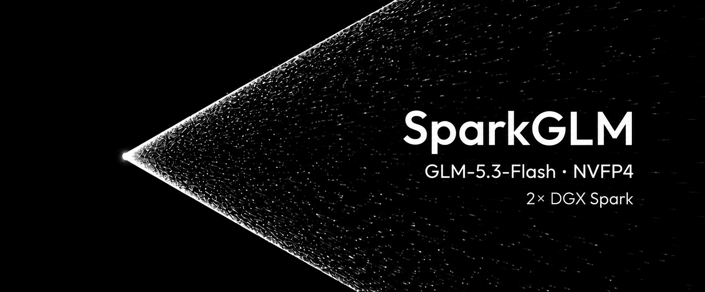

# SparkGLM



SparkGLM targets responsive **concurrent GLM-5.3-Flash serving on two NVIDIA
DGX Spark GB10 systems**, building on MiaAI-Lab's excellent two-Spark work.
`main` now defaults to our measured **NVFP4** path: native CUTLASS W4A4,
MXFP8 DFlash2, 512K context, 9 GiB KV per rank, 2K chunks and mixed scheduling.
SparkGLM runs independently with Docker and SSH; LLooM integration is optional. The latest EXL3 work remains on the
[`exl3` branch](https://github.com/Enntity/sparkglm/tree/exl3).

> **Source research preview:** this is the maintainer-selected measured default,
> not a production certification. No prebuilt image or complete G5 qualification
> is claimed. [Install](SPARKGLM.md) · [results](results/CURRENT.md) ·
> [video configurations](docs/PUBLISHED_VIDEO_CONFIGURATION.md).

In the earlier frozen matched suite, NVFP4 reduced 16K/32K C1 TTFT from
11.1/21.5 seconds to 8.9/17.1 seconds versus our reference EXL3 configuration;
C4/16K total wall fell from 78.54 to 57.21 seconds. Those NVFP4 runs used 64K
context. The newer videos use 512K and a separate staggered field-guide
workload; see the [full evidence and caveats](results/CURRENT.md).

NVFP4 trades additional resident weight/scale memory for faster native
prefill arithmetic. 512K is the tested window on our two Sparks, not a promise
of four simultaneous full-window requests. EXL3 still offers more memory
headroom and retains a tested 1M configuration.

The EXL3/TR3 checkpoint used for the included benchmark results was produced
using **ShapleyMCG by Brandon M. Music**. Its source-available license is separate
from this repository's code licenses; see the required notice and citation in
[quant attribution](docs/QUANT_ATTRIBUTION.md).

> This work includes or was produced using ShapleyMcg, created by Brandon M. Music (https://github.com/brandonmmusic-max/shapleymcg). ShapleyMcg is licensed under the ShapleyMcg License v1.0, an attribution-required license that grants no rights to the person known as "0xSero." Use of ShapleyMcg without this attribution is unlicensed.

> **Known semantic approximation:** the current FlashInfer SM121 compatibility
> path can represent 2048 sparse-MLA candidates while GLM-5.3 may produce 2051.
> SparkGLM retains the recent tail and omits the four lowest-ranked pooled
> candidates. This affects at most 4/2051 candidates at those rows, but it is
> still a model-semantic deviation—not “exact inference.” See
> [known limitations](docs/KNOWN_LIMITATIONS.md).

## Choose your path

- **I want to run the model:** [two-Spark quickstart](SPARKGLM.md), from
  prerequisites and migration to the first streamed answer. The current
  distribution builds from source; no qualified prebuilt image is published.
- **I want to improve it:** [contributor quickstart](CONTRIBUTING.md), with a
  laptop-only first test and a concrete tinyGLM candidate loop. No Sparks are
  needed to submit a source-only contribution.
- **I want the measurements:** [current evidence](results/CURRENT.md) and
  [methodology](docs/METHODOLOGY.md). Historical experiments are not defaults.

## How changes earn promotion

```text
idea -> static checks -> exact-shape operator -> tinyGLM
     -> full 16K/32K C1/C2 comparison -> quality/reliability -> default
```

This promotion path is the center of the project. tinyGLM is the mandatory
fast integration gate: it preserves the production kernel geometry without a
164 GiB model load. It decides whether a candidate deserves full-model time;
it never substitutes for real-model performance or quality evidence.

Read [the test methodology](docs/METHODOLOGY.md), then browse the canonical
[current qualification status](results/CURRENT.md) and the complete
[results and qualification index](results/README.md). Every performance claim
must point to a checksum-bound `qualification.json`. Pre-policy results are
kept as explicitly legacy evidence rather than retroactively certified.

## Start here

- **Check the component licenses before downloading:** read
  [docs/LICENSING.md](docs/LICENSING.md). The default uses the measured MXFP8 DFlash2 configuration. Its separately downloaded
  checkpoint is CC BY-NC-ND 4.0 and therefore non-commercial/no-derivatives;
  use a separately qualified alternative when those terms do not fit.
- **Run the current engine:** follow the build and two-node launch process in
  [SPARKGLM.md](SPARKGLM.md). It is the authoritative installation guide;
  the retained upstream README is historical reference.
  Stop any resident full model before building: native EXL3 compilation and a
  loaded checkpoint compete for the GB10's unified memory. The launcher now
  refuses a build below 32 GiB `MemAvailable` .
- **Reproduce what we showed:** the fresh-checkout defaults and their exact
  historical evidence are mapped in
  [the published-video configuration](docs/PUBLISHED_VIDEO_CONFIGURATION.md).
- **Understand what is original:** read
  [docs/PROVENANCE.md](docs/PROVENANCE.md) and
  [docs/ATTRIBUTION.md](docs/ATTRIBUTION.md), then consult the practical
  [licensing boundaries](docs/LICENSING.md).
- **Inspect the evidence:** see [docs/RESULTS.md](docs/RESULTS.md), retained raw
  receipts and reports under `results/`, and the code archive under
  `research/vllm-iterations/`.
- **Inspect the native-engine attempt:** see `research/atlas/`. It is valuable
  research, but it is not the recommended serving path.
- **Review before publication:** see
  [docs/PUBLICATION_REVIEW.md](docs/PUBLICATION_REVIEW.md).
- **Know what remains unproven:** read
  [docs/KNOWN_LIMITATIONS.md](docs/KNOWN_LIMITATIONS.md) before deployment or
  quoting a result.

## What is running code versus research

| Path | Status | Purpose |
| --- | --- | --- |
| repository root | current candidate | NVFP4 default installer, optional latest EXL3 profile, and shared engine foundation |
| `benchmarks/` | test harnesses | Reproducible endpoint, tinyGLM, and kernel A/B programs |
| `results/` | canonical evidence | Indexed qualification records, reports, raw receipts, limitations, and rejected work |
| `research/current-engine-history/` | provenance | Accepted commit mailbox without unsafe historical git objects |
| `research/vllm-iterations/` | historical | Accepted and rejected vLLM-era experiments, measurements, and patch mailboxes |
| `research/atlas/` | archival | AGPL Atlas GLM implementation, probes, and a reconstructable source patch |

The project deliberately retains negative results. A rejected patch is not an
optional optimization and should not be enabled merely because its source is
available.

## Evidence status

The current evidence includes checksum-bound operator, tinyGLM, full-model
comparison, semantic and context-capacity runs. The selected source preview
has **no complete G5 endurance certification**. See [current status](results/CURRENT.md)
for workload definitions and the bounded quality and memory limitations.
Earlier pre-policy campaigns remain explicitly labeled `legacy`; do not add
percentages across experiments or equate kernel speed with endpoint speed.

## What is not included

This repository contains no model checkpoints, EXL3/TR3 weight files,
DFlash2 weights, abliteration direction tensors, API credentials, private SSH
keys, compiled CUDA shared objects, Python caches, or machine-local `.env`
files. Downloaded artifacts remain under their own licenses and are fetched by
the operator from their original sources.

Generated comparison videos are also excluded from git. The raw JSON traces
and the rendering harness are retained so videos can be regenerated without
turning the source repository into a media archive.

## Hardware and scope

The optimized path is intentionally narrow:

- 2x NVIDIA DGX Spark / GB10 / SM121
- GLM-5.3-Flash
- TP=2
- NVFP4 compressed-tensors target; latest EXL3 remains an explicit option
- MXFP8 DFlash2 k=7, target and draft both TP2
- medium and long staggered workloads, not only short synthetic decode

Fallbacks and rollback knobs remain because a fast unsupported shape is a bug,
not an optimization.

Important defaults include work-conserving
`GLM53_MIXED_PREFILL_CHUNK=0`, the GB10-selected 16 ms TP spin window, and the
`rightsize` mode for `GLM53_INDEXER_WORKSPACE`. The NVFP4 profile adds native
CUTLASS MoE, 2K chunks and the measured 512K/9 GiB budget. The EXL3 profile
selects corrected concurrent E3 with 32-row temporary expert buffers.
See [video settings](docs/PUBLISHED_VIDEO_CONFIGURATION.md) and
[known limitations](docs/KNOWN_LIMITATIONS.md). Legacy `.env` knobs apply only
to `start-exl3.sh`; the managed default uses the explicit installer options.

## Licensing

SparkGLM is a multi-license repository because it preserves work from several
upstreams:

- Original project integration: Apache-2.0 unless an explicit path rule says
  otherwise.
- MiaAI-Lab serving-kit material and retained modifications: MIT; mixed vLLM
  patchers also retain Apache-2.0 obligations.
- Atlas-derived source and patches under `research/atlas/`: AGPL-3.0-only.
- The staggered benchmark `benchmarks/staggered_openai.py` and its archived
  campaign harnesses are also AGPL-3.0-only, not Apache-licensed serving code.
- Upstream FlashKDA source: MIT. SparkGLM's Atlas bridge is AGPL, while the
  slot patch contains MIT-derived context plus AGPL modifications.
- Other third-party material retains its file-level license and attribution.
- The bundled Z.ai chat template is covered by the GLM-5.3 License.

Read [LICENSE](LICENSE), [NOTICE](NOTICE), and
[docs/LICENSING.md](docs/LICENSING.md) before redistribution. The default
draft is fetched separately; its upstream non-commercial/no-derivatives
terms still matter. Alternative drafters require separate qualification.
The EXL3/TR3 checkpoint's ShapleyMCG License 1.0 requires attribution for
published results and includes a named-party/channel exclusion. It is
source-available, not OSI open source. Read
[the model licensing boundary](docs/LICENSING.md#model-boundary) before use.

## Publication gate

Run:

```bash
./scripts/check.sh all
```

Passing that script is necessary but not sufficient. A human should still
review the attribution table, benchmark wording, excluded-artifact list, and
every file named in `docs/PUBLICATION_REVIEW.md` before changing repository
visibility.
