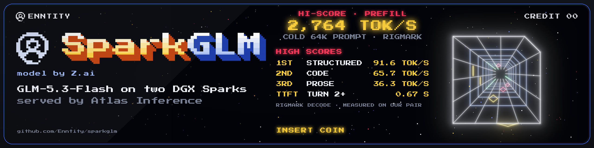

<p align="center">
  
</p>

# SparkGLM

GLM-5.3-Flash on two NVIDIA DGX Sparks, served by the
[Atlas](https://github.com/Enntity/atlas) inference engine: tensor and expert
parallelism across both boxes over one ConnectX-7 cable, NVIDIA's NVFP4
checkpoint, DFlash2 speculative decoding, prefix caching, up to four
concurrent requests with 512K context each, and an OpenAI-compatible API.
Multi-turn agents get a cached conversation back: a turn of a 45K-token
conversation starts in under a second instead of re-reading the whole
transcript.

```sh
git clone https://github.com/Enntity/sparkglm.git
cd sparkglm
cp .env.example .env      # set WORKER to the other Spark's ssh destination
./start.sh
```

## What it does

Measured on two DGX Sparks joined by one 200G cable, with images built from
a fresh clone. Receipts and caveats:
[the display carveout's KV placement](results/2026-10-05-carveout-placement/RESULT.md) (this release),
[a faster verify step and cheaper warm turns](results/2026-09-30-decode-step/RESULT.md),
[RigMark decode, prefill and staggered arrivals on this release](results/2026-10-05-rigmark/RESULT.md),
[RigMark short-code concurrency](results/2026-09-30-rigmark/RESULT.md),
[prefix cache on disk](results/2026-09-30-nvme-tier/RESULT.md),
[exact kernels and the prefix-cache policy](results/2026-09-30-exact-speedups/RESULT.md),
[index tails and 0.92 memory](results/2026-09-29-index-tails-092/RESULT.md),
[prefix caching](results/2026-09-29-prefix-caching/RESULT.md)
and [the first Atlas release](results/2026-09-29-atlas-merged/RESULT.md)
(quality row).

| Workload | SparkGLM (Atlas) | Reference, same pair |
|---|---|---|
| Multi-turn conversation, 30–48K tokens: time to first token on turns 2+ (median) | **0.67 s** | 17.6 s with caching off |
| Four concurrent ~204K-token sessions, cached follow-up turns | 12/12 exact answers | |
| Replaying a 35K-token prompt | **0.80 s** (14.4 s cold) | |
| New session sharing a 24K system prompt with earlier ones: time to first token | **15.7 s** | 36.2 s with the cache policy off |
| Idle session resuming after another session's 17 turns (median) | **2.5 s** | 49.6 s with the cache policy off |
| Cold 61K / 125K prompt: time to first token | **25.0 / 49.1 s** | 29.2 / 62.5 s two engines ago |
| Matrix: C1/C2 at 16K and 32K, C4 at 16K, 400 tokens each, cold (sum of walls) | **136.7 s** | vLLM SparkGLM 206.6 s · Mia TensorFold 165.6 s |
| Staggered C4: four ~16K requests arriving 1 s apart, cold (median of 5) | **49.3 s** | vLLM SparkGLM 70.5 s · Mia TensorFold 58.3 s · Mia EXL3 113.2 s |
| Single-stream prose decode, 5 × 384 tokens | **40.2–44.2 tok/s** | 32.8–34.5 tok/s on 2026-09-30, before the decode-step work |
| RigMark decode, code / prose / structured (thinking on, low effort) | **65.7 / 36.3 / 91.6 tok/s** | [RiNGSiDE](https://github.com/othexmr/GLM-5.3-Flash-NVFP4-2x-4x-DGX-Sparks-RiNGSiDE) vLLM TP2 (published) 56.5 / 33.0 / 83.4 |
| RigMark cold prefill 8K / 32K / 64K: time to first token | **3.28 / 12.35 / 23.71 s** | RiNGSiDE 3.56 / 12.94 / 25.66 s |
| RigMark staggered arrivals, prefill first: newcomer time to first token at 2 / 4 | **2.86 / 3.51 s** | RiNGSiDE 4.70 / 5.15 s |
| RigMark short code, 1 / 4 streams, aggregate (2026-09-30 release) | 45.8 / 67.0 tok/s | RiNGSiDE 44.0 at 1 stream; 97.3 at 6 streams (our 4 × 512K profile serves 4 at a time) |
| Returning to a ~209K-token conversation evicted to disk (prefix cache on disk, 48 GB) | **1.2–1.5 s** | about 82 s without it |
| Strict JSON (`response_format` json_schema), ~2,000-token structured answer | **30–50 s**, schema-valid | 135–155 s with masked serial decode |
| Strict JSON object with 96 required keys, temperature 0 | **39 s**, 59 tok/s, valid | engine killed (out of memory) two releases ago |
| Quality probe: arithmetic / two-hop 24K needle | 40/40 · 11/12 | |

These are measurements on our pair, not a guarantee for yours. Known gaps and
open questions are in [docs/LIMITATIONS.md](docs/LIMITATIONS.md).

## Requirements

- Two DGX Spark (GB10, 128 GB) systems joined by a direct ConnectX-7 cable,
  with an IPv4 address on the cable's interface on each (RoCE; the engine
  finds the GID itself and uses both PCIe halves of the port).
- Docker with the NVIDIA runtime on both, and passwordless `ssh` from the
  Spark you run `./start.sh` on to the other one, whose user can run `docker`.
- About 230 GB free on each Spark: the checkpoint takes 204 GB, the drafter
  2 GB and the converted overlay 16 GB. The 207 GB download is made once and
  copied to the other Spark over the cable (about a minute).
- Nothing else using the GPUs' memory. GB10 memory is shared with the host,
  and the engine uses most of it.

## What `./start.sh` does

Run it on the Spark that will serve the API (rank 0). Each step is skipped when
already done, so rerunning it just restarts the engine.

1. **Image.** Pulls `ghcr.io/enntity/atlas-sparkglm:<tag>`, whose tag is the
   git tree of [`install/`](install/), so the image always matches your
   checkout. If it isn't published or `BUILD=1` is set, it builds the image
   from source instead ([`install/build.sh`](install/build.sh): Atlas at the
   commit pinned in [`install/atlas-source.json`](install/atlas-source.json),
   FlashKDA and FlashInfer's sparse-MLA prefill; 30–60 minutes cold). It then
   pulls or copies the image to the other Spark.
2. **Weights.** Downloads [`nvidia/GLM-5.3-Flash-NVFP4`](https://huggingface.co/nvidia/GLM-5.3-Flash-NVFP4)
   and the [`incoai/GLM-5.3-Flash-DFlash2`](https://huggingface.co/incoai/GLM-5.3-Flash-DFlash2)
   drafter at pinned revisions, and copies them to the other Spark. It uses
   `hf` when installed and a throwaway container otherwise.
3. **Overlay.** On each Spark, converts the 864 MTP matrices Atlas needs to
   NVFP4 in an overlay that links back to the original checkpoint, then
   verifies every payload (about a minute; [`install/convert.sh`](install/convert.sh)).
4. **Serve.** Starts rank 1 over ssh, then rank 0, and waits for health
   (about 2.5 minutes), then answers one smoke-test question.

Other commands: `./start.sh stop | status | logs [worker] | build | download | convert`.

## Use it

The API listens on rank 0's loopback, `http://127.0.0.1:8893/v1`, model
`glm-5.3-flash-atlas`, with no authentication. Put your own authenticated
proxy in front of it before exposing it.

```sh
curl -s http://127.0.0.1:8893/v1/chat/completions -H 'Content-Type: application/json' -d '{
  "model": "glm-5.3-flash-atlas", "max_tokens": 256,
  "messages": [{"role": "user", "content": "Write a haiku about two small computers."}]}'
```

Streaming, tool calls, JSON and structured output, reasoning controls
(`chat_template_kwargs.enable_thinking`, `reasoning_effort`), images and short
videos are supported.

**Profiles** (`PROFILE` in `.env`):

- `4x512k` (default): up to four requests with up to 512K context each.
- `8x128k`: up to eight requests with up to 128K each, for more concurrent
  short work.

All requests share one FP8-latent KV pool that also holds the prefix cache:
about 600K tokens at the default `GPU_MEMORY_UTILIZATION` of 0.88, and about
1.13M at 0.91, which we run on Sparks that run nothing else (about 1.37M with
the display carveout, below). Above 0.91, real traffic took our rank 0 below
1 GiB free ([docs/LIMITATIONS.md](docs/LIMITATIONS.md)). Requests that don't
fit wait for room. Prefix caching keeps the 16 most recent conversations'
recurrent state warm.

## Prefix cache on disk (optional)

When the KV pool fills up, the prefix cache drops the conversations used
least recently, and one that comes back is prefilled again from the start.
With `PREFIX_CACHE_DIR` set, each Spark writes what it drops to its own disk
instead and reads it back when the conversation returns. In one pass on
2026-09-30, with 25K-token conversations pushed out of the cache, the time to
first token of turn 2 went from 10.7 s to 0.91 s and the answers were
byte-identical. Each restore read its blocks in about 75 ms (7.8 GB/s).

To turn it on, add to `.env` and rerun `./start.sh`:

```sh
PREFIX_CACHE_DIR=/srv/sparkglm/prefix-cache   # same path on both Sparks, on their own disk
PREFIX_CACHE_GB=48                             # GiB per Spark, 16-100 (default 48)
```

`start.sh` creates `kv/` and `ssm/` in the directory on both Sparks, refuses a
directory on tmpfs or without that much space free, and mounts it into each
rank. Half of the size holds KV blocks (6.66 KB per token; 24 GiB holds 3.9M
tokens, over twice the pool at 0.93). The other half holds the 78 MB
recurrent-state snapshots a restore starts from (24 GiB holds 330). A restore
needs both, so at 25K tokens the even split keeps about 150 conversations with
two snapshots each.

What it costs, per Spark:

- **KV pool.** The engine sets host memory aside for the tier and takes it
  out of the pool: 236 MiB whatever the size (staging, and two snapshot
  slots), plus 640 B for each 16-token block the KV half can hold, which is
  6.2 MiB per GiB. At the default that is 383.8 MiB. On our pair at 0.93 the
  pool lost about 4,000 of its 104,000 blocks, about 60K tokens (4%); at the
  default 0.88 the same 60K tokens are about 10% of the pool. Each GiB added
  to `PREFIX_CACHE_GB` costs about 500 more tokens. The fixed part is most of
  the cost, and 48 is the size we measured.
- **Disk.** The KV half is reserved when the engine starts; the snapshot half
  fills as needed. Every token pushed out of the pool writes 6.66 KB. Nothing
  is kept across a restart: the engine deletes its files as soon as it has
  them open, and clears leftovers from a crash when it starts.

## Display memory as KV cache (optional, DGX Spark only)

Each DGX Spark's firmware sets aside 2 GiB of memory for the display (the
`DISPLAY_FRM` carveout). Linux never sees it, and on the GB10 the NVIDIA
driver never allocates from it, so on a headless Spark it sits unused. With
`DISPLAY_CARVEOUT=1`, the engine borrows it for the KV cache: it places whole
per-layer latent KV pools there, so the pool grows while system memory stays
exactly as it was.

The GPU does not cache this memory in its L2 (the driver maps it uncached), so
data read more than once costs more there. The engine keeps the sparse-index
buffers, which every prefill query re-reads, in ordinary memory; placing them
in the carveout made a 64K cold prefill 7% slower
([results/2026-10-05-carveout-placement](results/2026-10-05-carveout-placement/RESULT.md)).

On our pair at 0.91 GPU memory utilization, the pool grows from 70,501 to
86,005 blocks per Spark (+19.4%, about 1.13M to 1.38M tokens). Cold prefill
at 32K and 64K stays within 0.7% of the carveout off, and greedy outputs are
unchanged.

To turn it on, add to `.env` and rerun `./start.sh`:

```sh
DISPLAY_CARVEOUT=1   # default off; set 0 or delete the line to roll back
```

What it takes:

- **Container privilege.** Exporting the carveout needs `CAP_SYS_ADMIN`, so
  each rank's container starts with `--cap-add SYS_ADMIN`. The engine starts
  through `spark display-carveout`, which exports the memory, takes a host
  lock, drops `CAP_SYS_ADMIN` from every capability set (including the
  bounding set) and only then starts the server. The server itself runs
  without it.
- **One user per Spark.** The lock in `/run/lock/sparkglm` lets one process
  per host hold the carveout. `start.sh` creates the directory.
- **Validated drivers only.** The engine uses the carveout only with NVIDIA
  driver versions checked against the open GPU kernel module source (580.173.02
  and 580.178.04). With another driver, or if the export fails, it serves
  without the carveout and logs why.
- **A headless Spark.** A display attached to the Spark could need that
  memory; we run ours headless.

This is SparkGLM-only: it ships in the SparkGLM layer of the engine fork, not
in the upstream Atlas series. The idea comes from kindling-spark-os's
`dispram` (see [Credits](#credits)).

## Reproduce our numbers

The benchmark drivers are in [`bench/`](bench/). See
[docs/REPRODUCE.md](docs/REPRODUCE.md) for the exact commands and the
comparison videos.

## Other ways to run it

- **By hand:** every step of `./start.sh` as a separate command, in
  [docs/INSTALL-MANUAL.md](docs/INSTALL-MANUAL.md).
- **With [LLooM](https://github.com/Enntity/lloom):** the recipe
  `linux-nvidia-dgx-spark-2x-glm53-atlas` puts SparkGLM behind LLooM's
  authenticated gateway ([docs/LLOOM.md](docs/LLOOM.md)).

## The engine

Atlas here is [`Enntity/atlas`](https://github.com/Enntity/atlas) branch
`sparkglm/atlas-20261009-rc2` (pinned in
[`install/atlas-source.json`](install/atlas-source.json)), built from three
layers:

1. Atlas-Inf `main`.
2. GLM-5.3-Flash support and optimizations (branch `upstream/glm53-flash`),
   which we intend to propose to Atlas-Inf after review. It started as
   Reiner Schmidt's port
   ([Mango-kid/atlas](https://github.com/Mango-kid/atlas/tree/feat/glm53-dual-spark));
   the engine's `docs/porting/GLM_5_3_FLASH.md` has the history.
3. SparkGLM-only commits: FlashKDA and native sparse-MLA prefill bridges,
   which rely on libraries built outside the Atlas tree, and the GB10
   display carveout.

## History

SparkGLM started as an Atlas research project: GLM-5.3-Flash on two DGX
Sparks with the Atlas engine. vLLM was far ahead at the time, so we moved to
it. On vLLM we started from an early version of
[MiaAI-Lab](https://github.com/MiaAI-Lab/GLM-5.3-Flash-EXL3-2x-DGX-Sparks)'s
two-Spark EXL3 recipe and reworked it, mostly for concurrency. We then
decided there was a lot we needed to fix at the engine level, and went back
to Atlas. Atlas is now the only engine.

The vLLM version is retired. It is preserved at the tag
[`vllm-final`](https://github.com/Enntity/sparkglm/tree/vllm-final) and the
branch `archive/vllm`, including its results and qualification records.

## Credits

The engine options SparkGLM turns on take their ideas from other projects. The
code is ours unless [docs/LICENSING.md](docs/LICENSING.md) says otherwise.

| Option | Idea from |
|---|---|
| `ATLAS_DFLASH_CONF_WIDTH` | knapcio's draft-shape truncation, `GLM_DRAFT_TRUNC` ([knapcio/GLM-5.3-Flash-4x-DGX-Spark-TP4](https://github.com/knapcio/GLM-5.3-Flash-4x-DGX-Spark-TP4)), whose calibration table (MIT) seeds ours; and the survival prefix product of D-Cut ([arXiv 2607.14647](https://arxiv.org/abs/2607.14647)) as Atlas-Inf implements it for MTP. We added online calibration, a fixed row price and a periodic full-width probe. |
| `ATLAS_GLM_DRAFT_TP` | MiaAI-Lab's `DFLASH_DRAFT_TP` ([GLM-5.3-Flash-EXL3-2x-DGX-Sparks](https://github.com/MiaAI-Lab/GLM-5.3-Flash-EXL3-2x-DGX-Sparks)) and TensorFold's two-rank drafter ([ashhart/TensorFold](https://github.com/ashhart/TensorFold)) |
| `ATLAS_GLM_PC_EVICT` | Reederey87's prefix-cache eviction policy ([glm53-flash-exl3-2x-dgx-spark](https://github.com/Reederey87/glm53-flash-exl3-2x-dgx-spark)) |
| `ATLAS_GLM_PC_BRANCH` | Marconi's branch-point admission (Pan et al., MLSys 2025, [arXiv:2411.19379](https://arxiv.org/abs/2411.19379)) |
| `ATLAS_GLM_STRICT_SPEC` | vLLM's speculative decoding with structured outputs ([#14702](https://github.com/vllm-project/vllm/pull/14702)) and its reasoning-boundary fix ([#44297](https://github.com/vllm-project/vllm/pull/44297)): per-position grammar masks over the draft window, the bonus row included, with the matcher rolled back after rejected drafts. We added per-rank masking for the vocab-split verify head. |
| `DISPLAY_CARVEOUT` | kindling-spark-os's `dispram` ([kindlingai/kindling-spark-os](https://github.com/kindlingai/kindling-spark-os), by mmastrac, coffee-the-dev and adapt-ai-systems; they credit an earlier NVIDIA developer forum post by emihuang). Our implementation was re-derived from the open GPU kernel modules and needs no daemon. |

Measurement: [RigMark](https://github.com/alexellis/rigmark) by Alex Ellis
(run from othexmr's fork with the staggered-arrival suite), the published
[RiNGSiDE](https://github.com/othexmr/GLM-5.3-Flash-NVFP4-2x-4x-DGX-Sparks-RiNGSiDE)
figures, [mmastrac](https://github.com/mmastrac/glm-5.3-flash-4x-gx10)'s
published figures and benchmark method (for earlier receipts), and MiaAI-Lab's
decode prompts.

## License

AGPL-3.0-only ([LICENSE](LICENSE)); third-party components keep their own
licenses ([NOTICE](NOTICE), [docs/LICENSING.md](docs/LICENSING.md)). The model
weights are not distributed here. **The DFlash2 drafter is licensed CC BY-NC-ND
4.0 (non-commercial).** Check both checkpoints' terms before downloading.
